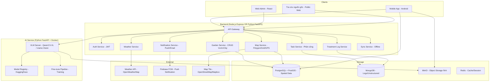

# Đề tài: Hệ thống Quản lý Cây trồng Nông nghiệp (Orilife)

> Tổng hợp từ buổi họp nhóm + trao đổi với thầy Nam (19-21/06/2026)
> + Tích hợp bản phân tích từ thành viên nhóm (hướng GPS + VLM cục bộ)

---

## 1. Hai hướng tiếp cận & So sánh

Nhóm hiện có **2 hướng tiếp cận** cho bài toán định danh và theo dõi cây:

### 1.1 So sánh tổng quan

| Tiêu chí | Hướng A: Tag vật lý (QR/RFID) | Hướng B: GPS + Ảnh (không tag) |
|----------|-------------------------------|--------------------------------|
| **Cách định danh** | Gắn tag vật lý (QR, Bar-code, RFID) lên cây, mỗi tag chứa mã ID duy nhất | Dùng toạ độ GPS + ảnh chụp cây để định danh, không cần tag vật lý |
| **Cách xác định cây** | Quét tag → app tự động nhận diện cây | Chụp ảnh tại vị trí → GPS + ảnh xác định cây nào |
| **Chi phí triển khai** | Cao: in tag, mua đầu đọc RFID, gắn hàng ngàn tag | Thấp: chỉ cần điện thoại có GPS + camera |
| **Bảo trì** | Tag hỏng/mất/phai → phải thay, treo lại | Không có tag để bảo trì |
| **Độ chính xác** | Rất cao (quét đúng tag = đúng cây) | Vừa phải (GPS dân dụng sai số 3-10m) |
| **Chống giả mạo** | Tag dễ bị tháo/tráo đổi | Ảnh + GPS khó giả mạo hơn (có bằng chứng hình ảnh) |
| **Khả năng mở rộng** | Tốn công gắn tag khi thêm cây mới | Chỉ cần chụp ảnh + lưu GPS khi thêm cây |
| **Phụ thuộc thiết bị** | Cần đầu đọc RFID chuyên dụng (~10-20 triệu) | Chỉ cần smartphone thông thường |
| **Rủi ro** | Treo sai tag → sai cây, khó phát hiện | GPS sai số → có thể nhầm cây bên cạnh (đặc biệt vườn dày) |

### 1.2 Phân tích sâu

**Hướng A (Tag vật lý)** — Phù hợp khi:
- Vườn đã có sẵn tag hoặc chủ sẵn sàng đầu tư phần cứng
- Cần độ chính xác tuyệt đối khi xác định cây
- Muốn quét nhanh từ xa (RFID quét 3-5m, không cần lại gần)
- Có máy đọc RFID chuyên dụng (như máy kiểm kho nhóm đã có)

**Hướng B (GPS + Ảnh)** — Phù hợp khi:
- Không muốn phụ thuộc phần cứng ngoài smartphone
- Vườn trồng thưa, cây cách xa nhau (>5m)
- Muốn giảm chi phí triển khai và bảo trì
- Ưu tiên tính linh hoạt, dễ mở rộng

### 1.3 Đề xuất: Kết hợp cả hai (Hybrid)

> **Chiến lược:** Dùng GPS + Ảnh làm nền tảng định danh, Tag vật lý là optional tăng độ chính xác.

- **Mặc định:** Mỗi cây có ID + toạ độ GPS + bộ ảnh theo thời gian. App dùng GPS để gợi ý cây gần nhất.
- **Optional:** Nếu vườn có gắn tag QR/RFID → quét tag để xác nhận chính xác, ghi đè GPS.
- **Lợi ích:** Không bị khoá vào phần cứng, vẫn giữ được độ chính xác nếu có tag.

---

## 2. Tổng hợp ý tưởng từ 2 bản phân tích

### 2.1 Điểm chung (cả 2 hướng đều có)

| Chức năng | Mô tả |
|-----------|-------|
| Quản lý vườn (Garden CRUD) | Khai báo vườn, ranh giới, loài cây, chủ sở hữu |
| Quản lý cây (Tree CRUD) | Mỗi cây có ID duy nhất, loài, ngày trồng, vị trí |
| Bản đồ 2D | Hiển thị vị trí cây trên bản đồ, tương tác click xem chi tiết |
| Chụp ảnh & Timeline | Chụp ảnh cây theo thời gian, tạo dòng thời gian theo dõi |
| AI thẩm định ảnh | Dùng AI đánh giá tình trạng cây qua ảnh (sâu bệnh, sinh trưởng, độ chín) |
| Mobile App | App Android cho nhân viên hiện trường |
| Web Admin | Dashboard quản lý cho chủ vườn |
| Phân quyền | Chủ vườn / Quản lý / Nhân viên / Người kiểm định |

### 2.2 Điểm khác biệt

| Khía cạnh | Hướng A (Tag) | Hướng B (GPS) |
|-----------|---------------|---------------|
| **Định danh cây** | Quét QR/RFID → nhận diện ngay | Chụp ảnh + GPS → so khớp toạ độ |
| **Công nghệ AI** | TensorFlow Lite phân loại bệnh | VLM (Qwen2.5-VL, Llama Vision) đọc ảnh + text |
| **AI chạy ở đâu** | On-device (mobile) | Server GPU cục bộ (Docker) |
| **Backend** | Node.js Express + MongoDB | Python FastAPI + PostgreSQL + PostGIS |
| **Bảo mật AI** | Gọi cloud API (OpenAI/Claude) | AI chạy cục bộ, không gửi data ra ngoài |
| **Truy xuất nguồn gốc** | Không đề cập | Có (chữ ký số C2PA cho ảnh) |
| **Offline** | Có đề xuất | Có đề xuất |

### 2.3 Điểm mạnh riêng của từng bản

**Bản nhóm (Hướng A - Tag):**
- Task Management (phân công công việc)
- Treatment Log (nhật ký canh tác)
- Weather Integration (tích hợp thời tiết)
- Smart Alert (cảnh báo thông minh, phát hiện dịch)
- IoT Sensor Integration

**Bản bạn (Hướng B - GPS):**
- Không phụ thuộc tag vật lý → chi phí thấp, dễ triển khai
- VLM chạy cục bộ → bảo mật dữ liệu, không tốn API phí
- PostGIS → truy vấn không gian mạnh (tìm cây gần nhất, trong bán kính...)
- Truy xuất nguồn gốc nông sản (C2PA) → hướng thương mại hoá
- Fine-tune model trên ảnh sầu riêng → độ chính xác cao hơn
- Docker hoá toàn bộ → dễ deploy, tái tạo môi trường

---

## 3. Phản hồi của thầy Nam & Điều chỉnh

| Vấn đề | Ý kiến thầy | Điều chỉnh của nhóm |
|--------|-------------|---------------------|
| Đề tài | **"Đơn giản quá, không đủ cho đề tài thực tập"** | Đã bổ sung: AI nhận diện bệnh (VLM), bản đồ GPS, task management, treatment log, weather, smart alert |
| Tên đề tài | Gợi ý: "Hệ thống quản lý cây trồng" | Đề xuất: **"Ứng dụng Quản lý Trang trại & Theo dõi Cây thân gỗ (Hệ thống Orilife)"** |
| Giải pháp định vị | Nên chọn giải pháp 1 (vẽ vườn ảo), GPS dân dụng sai số lớn | Kết hợp: Grid mapping làm nền + GPS hỗ trợ + Tag optional |
| Cách định danh | In QR code / Bar code gắn lên thân cây | Hybrid: QR/Bar-code là optional, GPS + ảnh là nền tảng |
| Tech stack | Backend + Web Admin (React/NextJS) + Mobile App (Android) | Giữ nguyên, cân nhắc thêm Python FastAPI cho AI service |
| Mã định danh | Dài 10-16 ký tự | Giữ nguyên |

---

## 4. Phân tích mở rộng - Các chức năng đề xuất

> Mục tiêu: tăng độ phức tạp để đủ tầm đồ án thực tập, thậm chí đồ án tốt nghiệp.

---

### 4.1 Nhận diện bệnh/sâu hại qua ảnh (AI / Computer Vision) ★★★★

| Mục | Chi tiết |
|-----|----------|
| **Mô tả** | Worker chụp ảnh cây nghi bị bệnh → model AI phân loại bệnh (nấm, vi khuẩn, thiếu dinh dưỡng, sâu hại...) |
| **Hướng A** | TensorFlow Lite (on-device, không cần mạng). Transfer learning từ MobileNet / EfficientNet |
| **Hướng B** | VLM (Qwen2.5-VL, Llama 3.2 Vision, Moondream2) chạy trên server GPU cục bộ qua Docker. Model đọc ảnh + text → đưa ra nhận định chi tiết |
| **Dataset** | PlantVillage, Cassava Leaf Disease, hoặc tự thu thập trên cây sầu riêng Việt Nam |
| **Thách thức** | Ảnh thực tế ngoài vườn: ánh sáng, góc chụp, nền nhiễu, nhiều bệnh cùng lúc |
| **Output** | Loại bệnh + độ tin cậy + khuyến nghị treatment |
| **Hướng phát triển** | Fine-tune model trên ảnh sầu riêng thực tế để tăng độ chính xác |

---

### 4.2 Theo dõi tăng trưởng cây theo timeline ★★★

| Mục | Chi tiết |
|-----|----------|
| **Mô tả** | Mỗi lần kiểm tra → lưu ảnh + metrics (chiều cao, tán lá, số trái, đường kính thân...) |
| **Features** | Timeline visualization, so sánh ảnh qua các mốc thời gian, biểu đồ tăng trưởng |
| **Phát hiện bất thường** | Nếu cây chậm phát triển hơn trung bình vườn → cảnh báo |
| **Dữ liệu** | Có thể nhập tay metrics, hoặc dùng AI ước tính từ ảnh |

---

### 4.3 Dự đoán năng suất (Yield Prediction) ★★★

| Mục | Chi tiết |
|-----|----------|
| **Mô tả** | Dựa trên giống cây, tuổi cây, số trái hiện tại, thời tiết, lịch sử năng suất mùa trước |
| **Model** | Regression (Linear Regression, Random Forest) hoặc Time-series |
| **Output** | Dự kiến sản lượng (kg), thời điểm thu hoạch tối ưu |

---

### 4.4 Hệ thống phân công công việc (Task Management) ★★

| Mục | Chi tiết |
|-----|----------|
| **Mô tả** | Chủ vườn tạo task: "Kiểm tra cây A01-A50", "Phun thuốc khu B", "Bón phân đợt 2" → gán cho worker |
| **Luồng** | Worker nhận task trên mobile → thực hiện → báo cáo kèm ảnh → chủ duyệt |
| **Tracking** | Trạng thái: pending → in_progress → done. Có deadline + reminder |
| **Liên kết** | Mỗi task gắn với 1 hoặc nhiều cây, tự động cập nhật vào lịch sử cây |

---

### 4.5 Nhật ký canh tác (Treatment Log) ★★

| Mục | Chi tiết |
|-----|----------|
| **Mô tả** | Ghi nhận mọi tác động lên cây: tưới nước, bón phân, phun thuốc, tỉa cành, thu hoạch |
| **Thông tin mỗi log** | Loại treatment, liều lượng, ngày thực hiện, người thực hiện, ghi chú |
| **Cảnh báo** | Quá liều / sai loại thuốc / khoảng cách giữa các lần phun không đủ |
| **AI tóm tắt** | "Cây A đã được bón phân 2 lần, phun thuốc 1 lần trong tháng này" |

---

### 4.6 Tích hợp thời tiết (Weather Integration) ★★

| Mục | Chi tiết |
|-----|----------|
| **Mô tả** | Gọi API thời tiết (OpenWeatherMap) theo vị trí vườn |
| **Cảnh báo** | Mưa lớn → hoãn phun thuốc. Nắng nóng kéo dài → tăng tưới, cảnh báo stress nhiệt |
| **Lịch sử** | Ghi nhận thời tiết vào lịch sử cây để sau phân tích tương quan thời tiết - năng suất - bệnh |

---

### 4.7 Hệ thống cảnh báo thông minh (Smart Alert) ★★

| Mục | Chi tiết |
|-----|----------|
| **Cảnh báo** | Cây bị đánh dấu "bệnh" → push notification + email cho chủ vườn |
| **Nhắc nhở** | Cây không được kiểm tra sau N ngày → nhắc kiểm tra định kỳ |
| **Phát hiện dịch** | "3 cây khu A cùng bị bệnh trong 1 tuần → có thể là dịch, cần cách ly/kiểm tra ngay" |
| **Kênh** | Push notification (mobile), email, in-app notification |

---

### 4.8 Bản đồ vườn ảo tương tác (Interactive Garden Map) ★★★★

| Mục | Chi tiết |
|-----|----------|
| **Mô tả** | Người dùng vẽ polygon bao quanh vườn trên bản đồ (Leaflet/MapLibre/Mapbox) |
| **Chia ô** | Tự động chia grid dựa trên diện tích + mật độ cây (spacing). Mỗi ô = 1 cây |
| **GPS** | Mỗi cây có toạ độ GPS, hiển thị marker trên bản đồ |
| **Tương tác** | Click vào marker/ô → xem thông tin cây + hồ sơ ảnh. Color-code: xanh = khỏe, vàng = cần chú ý, đỏ = bệnh |
| **Vẽ thủ công** | Hỗ trợ vẽ từng điểm cây nếu vườn trồng không theo grid đều |
| **Tìm cây gần nhất** | Dùng GPS hiện tại → tìm cây gần nhất trong bán kính (PostGIS / spatial query) |

---

### 4.9 Hỗ trợ ngoại tuyến (Offline-First Mobile) ★★★★

| Mục | Chi tiết |
|-----|----------|
| **Mô tả** | Mobile app lưu data cục bộ (SQLite/Room). Ra vườn không có mạng → vẫn chụp ảnh, ghi chú, lưu GPS |
| **Đồng bộ** | Về khu vực có mạng → sync ảnh + data lên server (MinIO / Object Storage) |
| **Xử lý conflict** | 2 người cùng sửa 1 cây khi offline → chiến lược merge (last-write-wins hoặc manual resolve) |

---

### 4.10 Đa vườn & Phân quyền (Multi-tenant) ★★★

| Mục | Chi tiết |
|-----|----------|
| **Mô tả** | Một chủ vườn có thể có nhiều vườn. Mỗi vườn có nhiều khu (zone) |
| **Vai trò** | Chủ vườn (owner), Quản lý vườn (manager), Nhân viên làm vườn (worker), Chuyên gia nông nghiệp (expert - được mời tư vấn từ xa), Người mua/kiểm định (viewer - tra cứu nguồn gốc) |
| **Phân quyền** | Owner: toàn quyền. Manager: quản lý vườn được gán. Worker: chỉ xem/thao tác trên cây được phân công. Expert: chỉ xem, không sửa. Viewer: chỉ xem thông tin nguồn gốc |

---

### 4.11 Dashboard Thống kê & Báo cáo ★★

| Mục | Chi tiết |
|-----|----------|
| **Thống kê** | Tỉ lệ cây khỏe/bệnh theo vườn/khu, năng suất dự kiến, tiến độ công việc |
| **Biểu đồ** | Xu hướng: số ca bệnh theo thời gian, hiệu quả treatment, số task hoàn thành |
| **Export** | Báo cáo PDF/Excel |
| **So sánh** | So sánh giữa các mùa vụ, giữa các vườn |

---

### 4.12 Cảm biến môi trường (IoT Sensor Integration) ★★★★

| Mục | Chi tiết |
|-----|----------|
| **Mô tả** | Cảm biến độ ẩm đất, nhiệt độ, độ ẩm không khí, ánh sáng → data real-time |
| **Dashboard** | Hiển thị real-time trên dashboard |
| **Cảnh báo** | Vượt ngưỡng → cảnh báo tưới nước, che nắng... |
| **Giả lập** | Nếu không có phần cứng thật, dùng MQTT simulator để có data demo |

---

### 4.13 Chatbot AI thẩm định ảnh (VLM Agent) ★★★★

| Mục | Chi tiết |
|-----|----------|
| **Mô tả** | Người dùng nhập ID cây → hệ thống nạp toàn bộ ảnh của cây cho VLM → AI đọc ảnh và đưa ra nhận định |
| **Model** | Qwen2.5-VL, Llama 3.2 Vision, Moondream2 — tải từ HuggingFace, chạy cục bộ trên server GPU |
| **Output** | Đánh giá sâu bệnh, tình trạng sinh trưởng, độ chín + gợi ý xử lý |
| **Tóm tắt cây** | "Cây A (sầu riêng, 5 tuổi): 3 tháng qua phát triển tốt, 1 lần bị nấm lá (đã xử lý), đợt này đang ra hoa" |
| **Cảnh báo chủ động** | "Cây A chậm phát triển hơn 25% so với trung bình khu vực, nên kiểm tra" |
| **Bảo mật** | AI chạy cục bộ, không gửi ảnh ra cloud → bảo mật dữ liệu vườn |
| **Hạn chế** | Cần GPU server (tối thiểu 8GB VRAM), tốc độ inference phụ thuộc model |

---

### 4.14 Truy xuất nguồn gốc nông sản ★★

| Mục | Chi tiết |
|-----|----------|
| **Mô tả** | Mỗi cây có hồ sơ đầy đủ: giống, ngày trồng, lịch sử canh tác, ảnh theo thời gian |
| **Chữ ký số** | C2PA (Content Credentials) cho ảnh bằng chứng — chống giả mạo |
| **Tra cứu** | Người mua/kiểm định quét mã truy xuất → xem toàn bộ lịch sử cây |
| **Giá trị** | Tăng niềm tin người mua, phục vụ xuất khẩu (truy xuất nguồn gốc là yêu cầu bắt buộc với nhiều thị trường) |

---

## 5. Đề xuất tổ hợp chức năng (sau khi tích hợp 2 bản)

> Nguyên tắc: chọn 5-7 nhóm chức năng chính, trong đó có ít nhất 2-3 chức năng "nặng".

| # | Chức năng | Độ khó | Nguồn | Ghi chú |
|---|-----------|--------|-------|---------|
| 1 | **Core:** CRUD Vườn + Cây + Định danh hybrid (GPS + Tag optional) | ★★ | Cả 2 | Nền tảng |
| 2 | **Core:** Mobile App (Android) + Web Admin (React) | ★★ | Cả 2 | 2 platform |
| 3 | **AI:** VLM thẩm định ảnh cây (chạy cục bộ, Docker) | ★★★★ | Bản bạn | Điểm nhấn chính |
| 4 | **AI:** Fine-tune model trên ảnh sầu riêng | ★★★★ | Bản bạn | Nâng cao độ chính xác |
| 5 | **Bản đồ:** Interactive Garden Map + GPS + Grid Mapping | ★★★★ | Cả 2 | Giải pháp hybrid |
| 6 | **Nghiệp vụ:** Task Management + Treatment Log | ★★★ | Bản nhóm | Đầy đủ nghiệp vụ |
| 7 | **Truy xuất:** Nguồn gốc nông sản + C2PA | ★★ | Bản bạn | Giá trị thương mại |
| 8 | *(Tùy chọn)* Offline Mode + Sync | ★★★★ | Cả 2 | Nếu còn sức |
| 9 | *(Tùy chọn)* IoT Sensor | ★★★★ | Bản nhóm | Nếu có thiết bị |
| 10 | *(Tùy chọn)* Weather + Smart Alert | ★★ | Bản nhóm | Nhanh, tăng giá trị |

### Tổ hợp khuyến nghị (đủ nặng, khả thi)

```
1 + 2 + 3 + 5 + 6 + 7 + 10 = 7 modules chính
(4) Fine-tune model: làm nếu có thời gian + GPU
(8) Offline: làm sau khi core ổn định
```

→ Đủ sức cho đồ án tốt nghiệp, có chiều sâu AI (VLM + fine-tune), có giá trị thực tế (truy xuất nguồn gốc).

---

## 6. Kiến trúc tổng thể (đã tích hợp 2 hướng)

### 6.1 Architecture Diagram



### 6.2 Luồng hoạt động chính

**Luồng 1: Định danh cây bằng GPS + Ảnh (không tag)**
```
Mở app → Bật GPS → Đứng gần cây → App gợi ý cây gần nhất (spatial query)
→ Chọn cây (hoặc tạo mới nếu chưa có) → Chụp ảnh → Lưu kèm GPS + timestamp
```

**Luồng 2: Định danh cây bằng Tag (optional)**
```
Quét QR/RFID → App nhận diện ngay cây → Chụp ảnh/Ghi chú/Cập nhật trạng thái
→ GPS vẫn được lưu kèm để cập nhật vị trí mới nhất
```

**Luồng 3: AI thẩm định ảnh**
```
Web Admin: Chọn cây → Gửi yêu cầu thẩm định → AI Service lấy toàn bộ ảnh 
của cây từ MinIO → VLM phân tích → Trả về nhận định + gợi ý → Lưu kết quả
```

**Luồng 4: Truy xuất nguồn gốc**
```
Người mua quét mã QR truy xuất → Public Web hiển thị hồ sơ cây: 
giống, ngày trồng, lịch sử canh tác, ảnh timeline, chứng nhận (nếu có)
```

---

## 7. Data Model (đã tích hợp)

### 7.1 Garden (Vườn)

```json
{
  "gardenId": "gard_xxx",
  "name": "Vườn sầu riêng A",
  "ownerId": "user_xxx",
  "area": 2.5,
  "areaUnit": "ha",
  "treeCount": 1000,
  "treeType": "sầu riêng",
  "varieties": ["Monthong", "Ri6"],
  "spacing": { "row": 5, "column": 5, "unit": "m" },
  "boundary": {
    "type": "Polygon",
    "coordinates": [[[106.1, 10.2], [106.15, 10.2], [106.15, 10.25], [106.1, 10.25], [106.1, 10.2]]]
  },
  "gridConfig": {
    "enabled": true,
    "rows": 40,
    "columns": 25,
    "origin": { "lat": 10.2, "lng": 106.1 },
    "rotation": 15
  },
  "address": "Huyện X, Tỉnh Y",
  "createdAt": "ISO",
  "updatedAt": "ISO"
}
```

### 7.2 Tree (Cây)

```json
{
  "treeId": "tree_xxx",
  "gardenId": "gard_xxx",
  "zoneId": "zone_B",
  "tagCode": "DURIAN-A-0001",
  "tagType": "QR",
  "plantedDate": "2020-03-15",
  "variety": "Monthong",
  "gridPosition": { "row": 1, "col": 1 },
  "gpsPosition": { "lat": 10.201, "lng": 106.101 },
  "gpsUpdatedAt": "ISO",
  "status": "healthy",
  "createdAt": "ISO",
  "updatedAt": "ISO"
}
```

### 7.3 TreeImage (Ảnh cây - bảng riêng để quản lý timeline)

```json
{
  "imageId": "img_xxx",
  "treeId": "tree_xxx",
  "capturedById": "user_xxx",
  "capturedAt": "ISO",
  "gpsAtCapture": { "lat": 10.201, "lng": 106.101 },
  "imageUrl": "https://minio.xxx/bucket/tree_xxx/img_xxx.jpg",
  "thumbnailUrl": "https://minio.xxx/bucket/tree_xxx/img_xxx_thumb.jpg",
  "c2paSignature": "base64...",
  "metadata": {
    "deviceModel": "Samsung S24",
    "resolution": "4000x3000",
    "fileSize": 2450000
  },
  "createdAt": "ISO"
}
```

### 7.4 TreeCheck (Lần kiểm tra / thẩm định)

```json
{
  "checkId": "chk_xxx",
  "treeId": "tree_xxx",
  "checkedById": "user_xxx",
  "checkedAt": "ISO",
  "checkType": "manual",
  "status": "disease",
  "diseaseType": "fungus_leaf_spot",
  "diseaseConfidence": 0.87,
  "notes": "Xuất hiện đốm nâu ở lá già, khoảng 15% tán",
  "metrics": {
    "height": 350,
    "heightUnit": "cm",
    "canopyWidth": 280,
    "canopyWidthUnit": "cm",
    "fruitCount": 45
  },
  "imageIds": ["img_001", "img_002"],
  "weather": {
    "temperature": 32,
    "humidity": 78,
    "rainfall": 0
  }
}
```

### 7.5 AIAssessment (Kết quả thẩm định AI)

```json
{
  "assessmentId": "asmt_xxx",
  "treeId": "tree_xxx",
  "requestedById": "user_xxx",
  "modelName": "Qwen2.5-VL-7B",
  "modelVersion": "1.2.0",
  "inputImageIds": ["img_001", "img_002", "img_003"],
  "requestedAt": "ISO",
  "completedAt": "ISO",
  "result": {
    "summary": "Cây có dấu hiệu nấm lá (đốm nâu), mức độ nhẹ (~15% tán). Sinh trưởng bình thường.",
    "diseases": [
      {
        "name": "nấm đốm lá",
        "confidence": 0.87,
        "severity": "nhẹ",
        "affectedArea": "15% tán lá già"
      }
    ],
    "growthAssessment": "Bình thường, không có dấu hiệu chậm phát triển",
    "ripenessAssessment": null,
    "recommendations": [
      "Phun thuốc trừ nấm gốc đồng (Copper Oxychloride)",
      "Cắt tỉa lá già bị nhiễm",
      "Theo dõi sau 7 ngày"
    ]
  },
  "createdAt": "ISO"
}
```

### 7.6 Task (Công việc)

```json
{
  "taskId": "task_xxx",
  "gardenId": "gard_xxx",
  "title": "Phun thuốc trừ nấm khu B",
  "description": "Phun Copper Oxychloride 0.3% cho các cây bị nấm đốm lá",
  "taskType": "spray",
  "assignedTo": "user_xxx",
  "assignedBy": "user_owner",
  "targetTreeIds": ["tree_001", "tree_002", "tree_005"],
  "status": "pending",
  "priority": "high",
  "deadline": "ISO",
  "completedAt": null,
  "completedById": null,
  "resultNotes": null,
  "resultImageIds": [],
  "createdAt": "ISO"
}
```

### 7.7 Treatment Log (Nhật ký canh tác)

```json
{
  "treatmentId": "trt_xxx",
  "treeId": "tree_xxx",
  "taskId": "task_xxx",
  "treatmentType": "fertilize",
  "product": "NPK 15-15-15",
  "dosage": 500,
  "dosageUnit": "g",
  "appliedBy": "user_xxx",
  "appliedAt": "ISO",
  "notes": "Bón gốc, tưới nước sau bón",
  "weather": {
    "temperature": 30,
    "humidity": 75,
    "condition": "cloudy"
  }
}
```

### 7.8 User & Roles

```json
{
  "userId": "user_xxx",
  "fullName": "Nguyễn Văn A",
  "email": "a@example.com",
  "phone": "0912345678",
  "role": "owner",
  "assignedGardens": [
    { "gardenId": "gard_xxx", "role": "owner" },
    { "gardenId": "gard_yyy", "role": "manager" }
  ],
  "createdAt": "ISO"
}
```

### 7.9 TraceabilityRecord (Truy xuất nguồn gốc)

```json
{
  "traceId": "trace_xxx",
  "treeId": "tree_xxx",
  "harvestId": "harv_xxx",
  "harvestDate": "ISO",
  "productLot": "DURIAN-2026-BATCH-001",
  "certifications": ["VietGAP", "GlobalGAP"],
  "c2paManifestUrl": "https://minio.xxx/manifests/trace_xxx.json",
  "publicAccessToken": "pub_xxx",
  "createdAt": "ISO"
}
```

---

## 8. Tech Stack (so sánh 2 phương án)

| Layer | Phương án A (Node.js) | Phương án B (Python) | Đề xuất |
|-------|----------------------|---------------------|---------|
| **Backend chính** | Node.js + Express.js | Python + FastAPI | **Node.js** (tận dụng codebase hiện có) |
| **AI Service** | Gọi cloud API (OpenAI/Claude) | FastAPI + VLM cục bộ (Docker) | **Python FastAPI** (chạy riêng, gọi từ Node.js) |
| **Database chính** | MongoDB | PostgreSQL + PostGIS | **PostgreSQL + PostGIS** (spatial query mạnh) + **MongoDB** (logs, unstructured) |
| **Object Storage** | Cloudinary / Local FS | MinIO | **MinIO** (tự host, S3-compatible, rẻ) |
| **Cache** | Redis | Redis | **Redis** |
| **Web Admin** | React + Vite | React + Vite | **React + Vite** (tận dụng codebase) |
| **Mobile** | Android Java/XML | Android (Kotlin/Java) | **Android Java** (tận dụng codebase) |
| **Map (Web)** | Leaflet.js | Leaflet / MapLibre | **Leaflet.js** (nhẹ, miễn phí, OSM) |
| **Map (Mobile)** | Mapbox SDK | Mapbox / OSM | **OSMDroid** (miễn phí) hoặc Mapbox |
| **AI Model** | TensorFlow Lite (mobile) | VLM HuggingFace (server) | **VLM server** (chính) + TF Lite (optional cho offline) |
| **Push Notification** | Firebase FCM | Firebase FCM | **Firebase FCM** |
| **Weather** | OpenWeatherMap | OpenWeatherMap | **OpenWeatherMap** |
| **Deploy** | PM2 / Docker | Docker | **Docker Compose** (toàn bộ stack) |
| **CI/CD** | GitHub Actions | GitHub Actions | **GitHub Actions** |

### Kiến trúc hybrid đề xuất

```
┌─────────────────────────────────────────────────┐
│                  Docker Compose                   │
│                                                   │
│  ┌──────────┐  ┌──────────┐  ┌────────────────┐ │
│  │ Node.js  │  │ Python   │  │ PostgreSQL     │ │
│  │ Express  │──│ FastAPI  │  │ + PostGIS      │ │
│  │ :6969    │  │ :8000    │  │ :5432          │ │
│  │ (CRUD,   │  │ (VLM AI, │  └────────────────┘ │
│  │  Auth,   │  │  Model)  │                      │
│  │  Map)    │  └──────────┘  ┌────────────────┐ │
│  └──────────┘                │ MinIO          │ │
│                              │ :9000 (ảnh)    │ │
│  ┌──────────┐  ┌──────────┐  └────────────────┘ │
│  │ MongoDB  │  │ Redis    │                      │
│  │ :27017   │  │ :6379    │  ┌────────────────┐ │
│  │ (logs)   │  │ (cache)  │  │ GPU Server     │ │
│  └──────────┘  └──────────┘  │ (VLM infer)    │ │
│                              └────────────────┘ │
└─────────────────────────────────────────────────┘
```

---

## 9. Lộ trình triển khai đề xuất (4 giai đoạn)

### Giai đoạn 1: Core System (nền tảng) — 3-4 tuần

- [ ] Thiết kế data model (Garden, Tree, TreeImage, User roles)
- [ ] Setup PostgreSQL + PostGIS + MongoDB + MinIO
- [ ] CRUD Vườn + Cây (với GPS + Grid position)
- [ ] Auth & Phân quyền (Owner/Manager/Worker/Expert/Viewer)
- [ ] API upload ảnh → MinIO (kèm GPS metadata)
- [ ] Mobile: chụp ảnh + lưu GPS + gán vào cây
- [ ] Web Admin: dashboard cơ bản, quản lý vườn/cây

### Giai đoạn 2: Garden Map & Nghiệp vụ — 3-4 tuần

- [ ] Vẽ vườn (polygon) trên bản đồ Leaflet
- [ ] Chia ô tự động (grid mapping) + hiển thị marker GPS
- [ ] Color-code cây theo trạng thái (khỏe/bệnh/cần chú ý)
- [ ] Tìm cây gần nhất (PostGIS spatial query)
- [ ] Task Management (tạo/gán/theo dõi/hoàn thành)
- [ ] Treatment Log (nhật ký canh tác)
- [ ] Weather Integration (OpenWeatherMap)
- [ ] Mobile: xem bản đồ, nhận task, cập nhật treatment

### Giai đoạn 3: AI & Nâng cao — 4-5 tuần

- [ ] Setup Python FastAPI service + Docker
- [ ] Tải VLM model từ HuggingFace (Qwen2.5-VL hoặc Llama Vision)
- [ ] API thẩm định ảnh: nhận treeId → lấy ảnh từ MinIO → VLM phân tích → trả kết quả
- [ ] Lưu kết quả AIAssessment vào DB
- [ ] Web: giao diện chatbot thẩm định (chọn cây → xem kết quả AI)
- [ ] Smart Alert (phát hiện dịch, nhắc kiểm tra định kỳ)
- [ ] Dashboard nâng cao (biểu đồ, thống kê, báo cáo)
- [ ] *(Optional)* Fine-tune VLM trên ảnh sầu riêng thực tế

### Giai đoạn 4: Hoàn thiện & Mở rộng — 2-3 tuần

- [ ] Truy xuất nguồn gốc (public page + QR code)
- [ ] C2PA chữ ký số cho ảnh (nếu đủ thời gian)
- [ ] Offline mode + Sync (SQLite/Room trên mobile)
- [ ] IoT Sensor (MQTT simulator nếu không có phần cứng)
- [ ] Export báo cáo PDF/Excel
- [ ] Testing & Polish UI
- [ ] Docker Compose hoàn chỉnh (1 lệnh `docker-compose up`)

---

## 10. Câu hỏi cần làm rõ với thầy

1. **Định danh cây:** Thầy đồng ý hướng hybrid (GPS + ảnh là nền, tag QR/RFID optional) không?
2. **Phần cứng RFID:** Nhóm có giữ được máy quét RFID không? Nếu không, tập trung vào QR + GPS?
3. **AI chạy cục bộ:** Server GPU có sẵn không, hay dùng cloud GPU (Colab, RunPod)? Nếu không có GPU, có thể dùng API cloud (OpenAI Vision / Claude Vision) thay thế?
4. **Dataset AI:** Có cần tự thu thập ảnh sầu riêng không, hay dùng dataset công khai (PlantVillage...) là được?
5. **IoT:** Có cần làm cảm biến thật không, hay giả lập MQTT là được?
6. **Deploy:** Có cần deploy thật không (VPS, domain...)? Hay demo local là đủ?
7. **Mức độ hoàn thiện UI/UX:** Demo được chức năng hay phải polish như production?
8. **Tech stack:** Thầy có yêu cầu cụ thể về ngôn ngữ/framework không? (Node.js vs Python, React vs Next.js...)

---

## 11. Ghi chú

- **Giải pháp hybrid (GPS + Grid + Tag optional):** Kết hợp ưu điểm cả 2 hướng, không bị khoá vào phần cứng
- **VLM cục bộ:** Điểm nhấn chính về AI — bảo mật, không tốn API phí, có thể fine-tune
- **PostGIS:** Cần thiết cho spatial query (tìm cây gần nhất, cây trong bán kính, vẽ polygon)
- **MinIO:** Tự host object storage, S3-compatible, không tốn phí cloud storage
- **Tận dụng codebase hiện có:** Backend Node.js/Express + React admin + Android Java đã có sẵn structure, refactor sang domain mới
- **Docker Compose:** Toàn bộ stack đóng gói trong 1 file, chạy 1 lệnh, dễ demo và bảo vệ

---

> Cập nhật: 21/06/2026
> Nhóm: Bùi Đình Tuấn & cộng sự
> GV hướng dẫn: Thầy Trần Hoàng Nam
